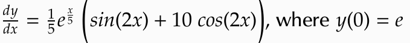
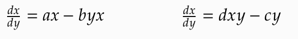

# Assignment 3 - Numerical Methods (Template)


> * Participant name: (your name)

## General Introduction
A Continuous-based Simulation of a model describes systematically and methodically mathematical representations of dynamic systems. These mathmatical equations are usually described by sets of either ordinary or partial differential equations possibly coupled with algebraic equations, can be simulated on a digital computer by numerical simulation. The most common form for these equations take are Intial Value Problems (IVP). In physics or other sciences, modeling a system frequently amounts to solving an initial value problem; in this context, the differential initial value is an equation that is an evolution equation specifying how, given initial conditions, the system will evolve with time.

## Numerical Analysis of Intial Value Problems
We looked at numerical solutions to Initial Value Problems. IVPs consist of an ordinary differential equation with an initial condition. We learned this mathematical model helps us simulate a system’s evolution over time. We also learned that numerical solutions are only approximations to symbolic (analytical) solutions. To compare the error we solved for the exact solution and compared the results to the numerical solution results.

Let's look at a first order IVP:



**(a)** Solve for the exact symbolic (analytical) solution. (*Hint: take the integral.*)

**(b)**  Code the mathematical formulas you now have into a dy_dx function and exact function. After step (a) you have the values for a dy_dx function and a exact function. (*Hint: Starter Code-Part1 - Define two functions in functions.py - We provided templates.*)

**(c)** Code and run three numerical integration solutions discussed in Webcourses: RK1, RK2, RK4. For this problem set *h=0.1* and solve for *x=<0,10>*. Code the full solution to the exact function for these same conditions. Graph the results to these 4 curves. (*Hint: Starter Code-Part1- look at the templates in numerical_solvers.py and how they are called in main.py*) - you must keep these function calls and file names the same as is defined in the starter code for testing.

**(d)** Plot the **Error** for these 3 integration schemes vs. the exact solution at each point. 

**(e)** Plot the change in error at x=100 for the 3 different numerical methods for differnt step size values. Start at 10. End at *0.001*. Plot at least 20 values between that range for h to visualize the error curve. Explain how Step-size affects the accuracy.

## Numerical Solvers in SciPy
Here we will look at additionally numerical solvers. Differential equations are solved in Python with the Scipy.integrate package using function ODEINT. ODEINT requires three inputs: 
```
y = odeint(model, y0, t)
```
* model: Function name that returns derivative values at requested y and t values as dydt = model(y,t)
* y0: Initial conditions of the differential states
* t: Time points at which the solution should be reported.

**(a)** Add functionality for using **odeint** to solve our IVP differential equation.
**(b)** Plot the result of (a) vs. the exact function. h=0.1 and solve for x=<0,10>
**(c)** Plot the **Error** again as you vary step size. How does *odeint* compare with your numerical simulations from Part 1?

## Numerical Simulation of the Lotka-Volterra Equations

The [**Lotka-Volterra Equations**](https://en.wikipedia.org/wiki/Lotka%E2%80%93Volterra_equations) are a pair of first-order non-linear ordinary differential equations that model a simple **Predator-Prey** senario. (This is a common input for many Agent-based Models). Here x represents a population of (terminator) robots - the predators, and y represents a population of humans - the prey.



Here a,b,c,d are constant (positive number) parameters. (For the homework a=b=c=d=1, but you should play a bit with these numbers to see what happens.)

**(a)** Here simulate and plot the population dynamics for *t=<0,20>* for *h=0.1* at *population_0=[2.0, 1.0]* - where population_0 contains the intial values [x0,y0]. (Use one of the 4 numerical simulators from above for the simulation.)

**(b)** Now plot Robots (x axis) vs Humans (y axis) 

